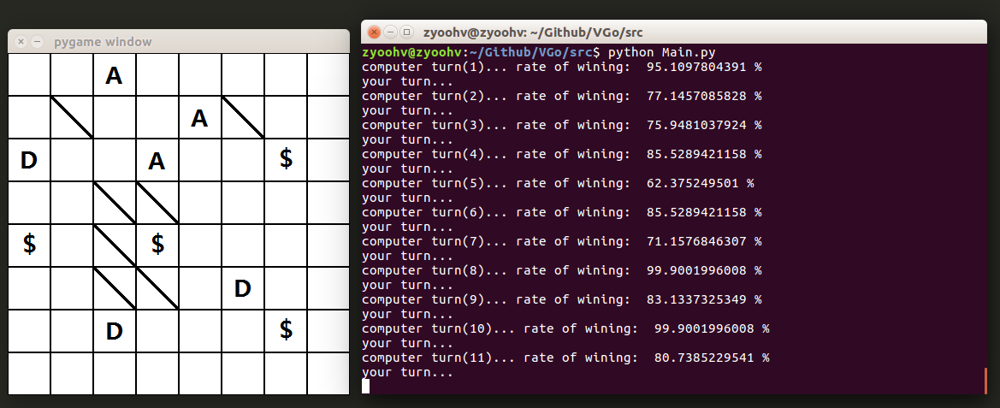

#一个垃圾的AI根本干不过人类呢

##Run Envrionment: Windows

*	python2.7 + pygame

##Run Envrionment: Linux

*	python2.7 + pygame

##What do we need now ?

*	finding a way to establish a more usefull 'Value Evaluate' algorithm, for example:

>	抽象成6 * 14维向量，进行分类学习。

>	缺点：没有对抗力度、走法不唯一

>	克服方式：和其他方法结合使用

##其他

*	More information in path "doc/", there may be something different ^.^
