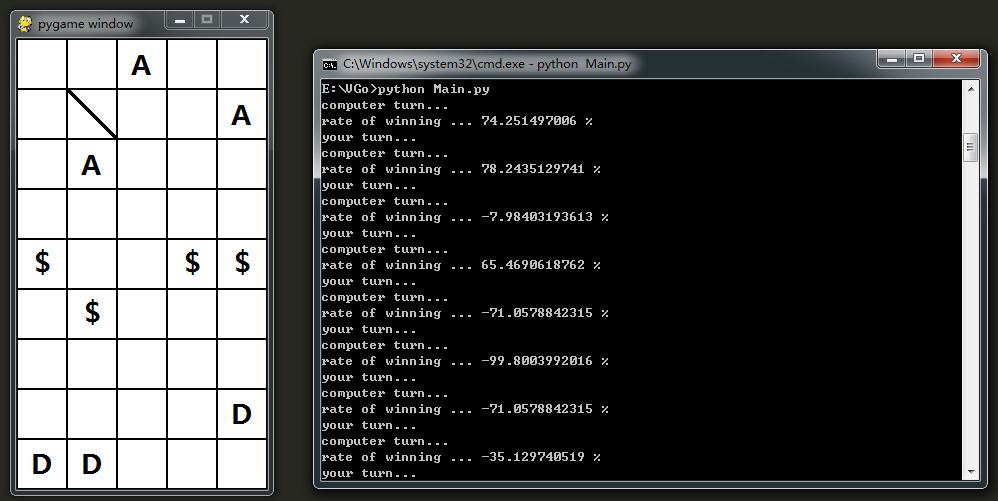

#一个垃圾的AI根本干不过人类呢

##运行环境 Windows

*	python2.7 + pygame

##运行环境 Linux

*	python2.7 + pygame

##待改进

*	more information in "src/Main.py"

##新的想法

*	抽象成6 * 14维向量，进行分类学习。

>	缺点：没有对抗力度、走法不唯一

>	克服方式：和其他方法结合使用

##其他

具体可以参考doc目录下的“建模”，“框架”说明

>	there may be something different ^.^

##运行效果截图

