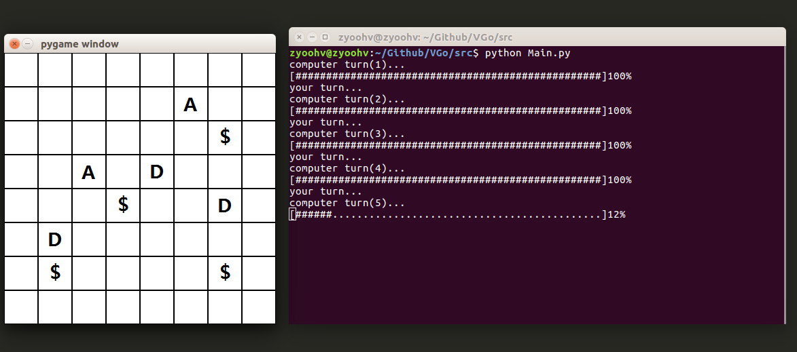

#一个垃圾的AI根本干不过人类呢

##Run Envrionment: Linux

*	python2.7 + pygame

##information

*	optimize the searching algorithm, such as random :)

*	new struct of the 'Searching Tree'

*	Return 'Defend_success' instead of '1/-1'

*	A more fair rule of the game

##What can you do for it ?

*	finding a way to establish a more usefull and more swift 'Value Evaluate' algorithm

*	all that can make VGo more powerful

##Others

*	More information in path "doc/", althrough there may be something different ^.^
