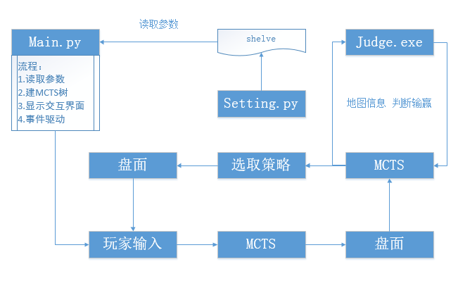
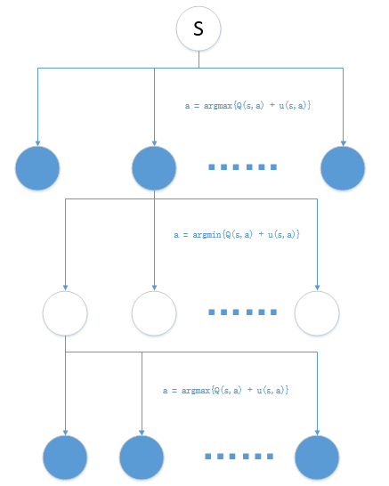

#简易智能响应系统框架

##算法

*	MCTS

##语言

*	python

*	c++

##规模

*	敌我各3支(共六只)队伍

*	我方4个资源点

##地图

*	正方形网格，(考虑增强为正六边形网格)

*	山脉若干(不可移动位置)、4个资源点、六只队伍。排列方式可由用户输入。

*	尺寸：20 X 20,(后期可增大)

##参数

|参数|含义|初始值|是否支持玩家修改|
|:--:|:--:|:----:|:----------------:|
|$Re$|最多损失资源点|2|是|
|$St$|回合限制|25|是|
|$Siz$|地图尺寸|20|否|
|-|攻击方初始位置|-|是|
|-|防守方防守位置|-|否|
|-|初始化地图|-|否|

>	以上不支持玩家修改的参数，一旦更改必须重新编译整个项目才可生效。下同。

##整体框架

*	由于技术复杂度成本等原因，界面考虑其他实现方法

##MCTS

*	分蓝白节点，白色节点表示轮到我放做决策

*	蓝色节点选取决策时，实际上是预测并模拟对方策略，此时我们假设敌方“足够聪明”，即优先选择我们认为更优的决策，这样我们就可以在此时选取使我方期望获胜概率更小的节点进行搜索。

*	参数

|参数|含义|初始值|是否支持玩家修改|
|:--:|:--:|:----:|:----------------:|
|$L$|树最大深度|5|否|
|$n_{thr}$|展开节点阈值|40|否|
|$n_{vl}$|访问时互斥系数|3|否|
|$c_{put}$|褒奖函数常数|5|否|
|$d$|每条线程搜索次数|100|否|
|$t$|线程数量|20|否|

##Judge

*	实现语言：c++

*	接受参数：地图所有信息

*	算法：枚举$4^3=64$种地方部队进攻目标，假设其直接向目标发起冲锋，计算能否防御成功。

*	输出：成功防守返回1，失败返回-1

##界面显示

*	参数位置可实时显示电脑判断守方胜率